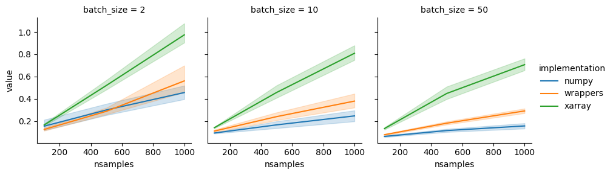

# DARTS nextgen

[](https://rye.astral.sh)
[](https://github.com/awi-response/darts-nextgen/actions/workflows/ruff.yml)
[](https://github.com/awi-response/darts-nextgen/actions/workflows/update_version.yml)

> Early Alpha!

Panarctic Database of Active Layer Detatchment Slides and Retrogressive Thaw Slumps from Deep Learning on High Resolution Satellite Imagery.
This is te successor of the thaw-slump-segmentation (pipeline), with which the first version of the DARTS dataset was created.

## Editor setup

There is only setup files provided for VSCode and no other editor (yet).
A list of extensions and some settings can be found in the `.vscode`.
At the first start, VSCode should ask you if you want to install the recommended extension.
The settings should be automaticly used by VSCode.
Both should provide the developers with a better experience and enforce code-style.

## Environment setup

Prereq:

- [Rye](https://rye.astral.sh/): `curl -sSf https://rye.astral.sh/get | bash`
- [GDAL](https://gdal.org/en/latest/index.html): `sudo apt update && sudo apt install libpq-dev gdal-bin libgdal-dev` or for HPC `conda install conda-forge::gdal`
- Clang: `sudo apt update && sudo apt install clang` or for HPC `conda install conda-forge::clang_linux-64`

> If you install GDAL via apt for linux you can view the supported versions here: <https://pkgs.org/search/?q=libgdal-dev>. For a finer controll over the versions please use conda.

Now first check your gdal-version:

```sh
$ gdal-config --version
3.9.2
```

And your CUDA version (if you want to use CUDA):

```sh
$ nvidia-smi
# Now look on the top right of the table
```

> The GDAL version is relevant, since the version of the python bindings needs to match the installed GDAL version

Now, to sync with a specific `gdal` version, add `darts-preprocessing/gdalXX` to the `--features` flag.
To sync with a specific `cuda` version, add `darts-ensemble/cuda1X` or without cuda `darts-ensemble/cpu`.
E.g.:

```sh
rye sync -f --features darts-preprocessing/gdal39,darts-ensemble/cuda12 # For CUDA 12 and GDAL 3.9.2
```

As of right now, the supported `gdal` versions are: 3.9.2 (`gdal39`), 3.8.5 (`gdal38`), 3.8.4 (`gdal384`), 3.7.3 (`gdal37`) and 3.6.4 (`gdal36`).
If your GDAL version is not supported (yet) please sync without GDAL and then install GDAL to an new optional group. For example, if your GDAL version is 3.8.4:

```sh
rye sync -f
rye add --optional=gdal384 "gdal==3.8.4"
```

> IMPORTANT! If you installed any of clang or gdal with conda, please ensure that while installing dependencies and working on the project to have the conda environment activated in which you installed clang and or gdal.

### Troubleshoot: Rye can't find the right versions

Because the `pyproject.toml` specifies additional sources, e.g. `https://download.pytorch.org/whl/cpu`, it can happen that the a package with an older version is found in these package-indexes.
If such a version is found, `uv` (the installer behind `Rye`) currently stops searching other sources for the right version and stops with an `Version not found` error.
This can look something like this:

```sh
No solution found when resolving dependencies:
  ╰─▶ Because only torchmetrics==1.0.3 is available and you require torchmetrics>=1.4.1, we can conclude that your requirements are unsatisfiable.
```

To fix this you can set an environment variable to tell `uv` to search all package-indicies:

```sh
UV_INDEX_STRATEGY="unsafe-best-match" rye sync ...
```

I recommend adding the following to your `.zshrc` or `.bashrc`:

```sh
# Change the behaviour of uv package resolution to enable additional sources without breaking existing version-requirements
export UV_INDEX_STRATEGY="unsafe-best-match"
```

Please see these issues:

- [Rye: Can't specify per-dependency package index / can't specify uv behavior in config file](https://github.com/astral-sh/rye/issues/1210#issuecomment-2263761535)
- [UV: Add support for pinning a package to a specific index](https://github.com/astral-sh/uv/issues/171)

## Architecture describtion

This repository is a workspace repository, managed by [Rye](https://rye.astral.sh/).
Read more about workspaces at the [Rye docs](https://rye.astral.sh/guide/workspaces/).
Each workspace-member starts with `darts-*` and can be seen as an own package, exexpt the `darts-pipeline` member.
Each package has it's own internal functions and it's public facing API.
The public facing API of each package MUST follow the following section [API paradigms](#api-paradigms).
The `darts-pipeline` is a [`virtual` project](https://rye.astral.sh/guide/virtual/), hence it can't be installed as a package and has no public facing API.

| Package Name            | Type     | Description                                                                           | (Major) Dependencies - all need Xarray                                    | Public Methods*                           |
| ----------------------- | -------- | ------------------------------------------------------------------------------------- | ------------------------------------------------------------------------- | ----------------------------------------- |
| `darts-ensemble`        | Ensemble | Ensembles the different models and run the multi-stage inference pipeline.            | PyTorch, `darts-superresolution`, `darts-detection`, `darts-segmentation` | `Ensemble.infer`                          |
| `darts-preprocessing`   | Data     | Loads data and combines the features to a Xarray Dataset                              | GDAL                                                                      | `scene_to_tiles`, `preprocess`            |
| `darts-acquisition`     | Data     | Fetches data from the data sources                                                    | GEE, rasterio, ?                                                          | `fetch_tcvis`, `fetch_s2`, `fetch_planet` |
| `darts-export`          | Data     | Saves the results from inference and combines the result to the final DARTS dataset   | GeoPandas, Scipy, Cucim                                                   | `export_tile`                             |
| `darts-superresolution` | Train    | Trains a supper resolution model to scale Sentinel 2 images from 10m to 3m resolution | PyTorch                                                                   | TBD                                       |
| `darts-detection`       | Train    | Trains an object detection model                                                      | PyTorch                                                                   | TBD                                       |
| `darts-segmentation`    | Train    | Trains an segmentation model                                                          | PyTorch, segmentation_models_pytorch                                      | TBD                                       |
| `darts-?`               | Train    | Trains a ?                                                                            | ?                                                                         | TBD                                       |
| `darts-evaluation`      | Test     | Evaluates the end-to-end process on a test dataset and external dataset               | GeoPandas                                                                 | `test_lewkowicz`, `test_ensemble`         |
| `darts-utils`           | Data     | Shared utilities for data processing                                                  | Scipy, Cucim, GeoPandas                                                   | TBD                                       |
| `darts-train-utils`     | Train    | Shared utilities for training                                                         | PyTorch                                                                   | TBD                                       |

\* : These public facing function (-names) are no hard requirements, they should rather help getting an idea of what and where needs to be implemented.

The `darts-pipeline` utilized [Ray](https://docs.ray.io/en/latest/index.html) to automaticly parallize the different computations.
However, each package should be designed so that one could build their own pipeline without Ray.
Hence, all Ray-related functions / transformations etc. should be defined in the `darts-pipeline` project.

The packages can decide to wrap their public functions into a CLI with typer.

The `Train` packages should also hold the code for training specific data preparation, model training and model evaluation.
These packages should get their data from (already processed) data from the `darts-preprocessing` package.
They should expose a statefull Model class with an `inference` function, which can be used by the `darts-ensemble` package.

> TBD: Would it be better if all "inference" functions are part of the `darts-ensemble` package?
> This would remove the dependency to each of the training repositories and with that potential dependencies to unused training-specific libraries (e.g. pytorch lightning)  
> TBD: Should the `darts-ensemble` package be split into `darts-inference` and `darts-ensemble`? - No  
> TBD: Should the `darts-evaluation` package be merged into the `darts-ensemble` package? - No  

The packages should follow this architecture:


### Conceptual migration from thaw-slump-segmentation

- The `darts-ensemble` package is the successor of the `process-02-inference` and `process-03-ensemble` scripts.
- The `darts-preprocessing` and `darts-acquisition` packages are the successors of the `setup-raw-data` script and manual work of obtaining data.
- The `darts-export` package is splitted from the  `inference` script, should include the previous manual works of combining everything into the final dataset.
- The `darts-superresolution` package is the successor of the `superresolution` repository.
- The `darts-detection` package is a new package.
- The `darts-segmentation` package is the successor of the `train` and `prepare_data` script.
- The `darts-evaluation` package is the successor of the different manual evaluations.

### Inference pipeline steps

> TODO: This is a draft and should be discussed

### API paradigms

The packages should pass the data as Xarray Datasets between each other. Datasets can hold coordinate information aswell as other metadata (like CRS) in a single self-describing object.
Since different `tiles` do not share the same coordinates or metadata, each `tile` should be represented by a single Xarray `Dataset`.

- Each public facing API function which in some way **transforms** data should accept a Xarray Dataset as input and return an Xarray Dataset.
  - Data can also be accepted as a list of Xarray Dataset as input and returned as a list of Xarray Datasets for batched processing.
    In this case, concattenation should happend internally and on `numpy` or `pytorch` level, NOT on `xarray` abstraction level.
    The reason behind this it that the tiles don't share their coordinates, resulting in a lot of empty spaces between the tiles and high memory usage.
    The name of the function should then be `function_batched`.
- Each public facing API function which **loads** data should return a single Xarray Dataset for each `tile`.
- Data should NOT be saved to file internally, with `darts-export` as the only exception. Instead, data should returned in-memory as a Xarray Dataset, so the user / pipeline can decide what to save and when.
- Function names should be verbs, e.g. `process`, `ensemble`, `do_inference`.
- If a function is stateless it should NOT be part of a class or wrapper
- If a function is stateful it should be part of a class or wrapper, this is important for Ray

Here are some examples, how these API paradigms should look like.

1. Single transformation

    ```py
    import darts-package
    import xarray as xr

    # User loads / creates the dataset (a single tile) by themself
    ds = xr.open_dataset("...")

    # User calls the function to transform the dataset
    ds = darts-package.transform(ds, **kwargs)

    # User can decide by themself what to do next, e.g. save
    ds.to_netcdf("...")
    ```

2. Batched transformation

    ```py
    import darts_package
    import xarray as xr

    # User loads / creates multiple datasets (hence, multiple tiles) by themself
    data = [xr.open_dataset("..."), xr.open_dataset("..."), ...]

    # User calls the function to transform the dataset
    data = darts_package.transform_batched(data, **kwargs)

    # User can decide by themself what to do next
    data[0].whatever()
    ```

3. Load & preprocess some data

    ```py
    import darts_package

    # User calls the function to transform the dataset
    ds = darts_package.load("path/to/data", **kwargs)

    # User can decide by themself what to do next
    ds.whatever()
    ```

4. Custom pipeline example

    ```py
    from pathlib import Path
    import darts_preprocess
    import darts_inference

    DATA_DIR = Path("./data/")
    MODEL_DIR = Path("./models/")
    OUT_DIR = Path("./out/")

    # Inference is a stateful transformation, because it needs to load the model
    # Hence, the 
    ensemble = darts_inference.Ensemble.load(MODEL_DIR)

    # The data directory contains subfolders which then hold the input data
    for dir in DATA_DIR:
        name = dir.name
        
        # Load the files from the processing directory
        ds = darts_preprocess.load_and_preprocess(dir)

        # Do the inferencce
        ds = ensemble.inference(ds)

        # Save the results
        ds.to_netcdf(OUT_DIR / f"{name}-result.nc")
    ```

5. Pipeline with Ray

    ```py
    from dataclasses import dataclass
    from pathlib import Path
    import ray
    import darts_preprocess
    import darts_inference
    import darts_export

    DATA_DIR = Path("./data/")
    MODEL_DIR = Path("./models/")
    OUT_DIR = Path("./out/")

    ray.init()

    # We need to wrap the Xarray dataset in a class, so that Ray can serialize it
    @dataclass
    class Tile:
        ds: xr.Dataset

    # Wrapper for ray
    def open_dataset_ray(row: dict[str, Any]) -> dict[str, Any]:
        data = xr.open_dataset(row["path"])
        tile = Tile(data)
        return {
            "input": tile,
        }
    
    # Wrapper for the preprocessing -> Stateless
    def preprocess_tile_ray(row: dict[str, Tile]) -> dict[str, Tile]:
        ds = darts_preprocess.preprocess(row["input"].ds)
        return {
            "preprocessed": Tile(ds),
            "input": row["input"]
        }

    # Wrapper for the inference -> Statefull
    class EnsembleRay:
        def __init__(self):
            self.ensemble = darts_inference.Ensemble.load(MODEL_DIR)

        def __call__(self, row: dict[str, Tile]) -> dict[str, Tile]:
            ds = self.ensemble.inference(row["preprocessed"].ds)
            return {
                "output": Tile(ds),
                "preprocessed": row["preprocessed"],
                "input": row["input"],
            }

    # We need to add 'local:///' to tell ray that we want to use the local filesystem
    files = data.glob("*.nc")
    file_list = [f"local:////{file.resolve().absolute()}" for file in files]

    ds = ray.data.read_binary_files(file_list, include_paths=True)
    ds = ds.map(open_dataset_ray) # Lazy open
    ds = ds.map(preprocess_tile_ray) # Lazy preprocess
    ds = ds.map(EnsembleRay) # Lazy inference

    # Save the results
    for row in ds.iter_rows():
        darts_export.save(row["output"].ds, OUT_DIR / f"{row['input'].ds.name}-result.nc")
    
    ```

#### About the Xarray overhead with Ray

Ray expects batched data to be in either numpy or pandas format and can't work with Xarray datasets directly.
Hence, a wrapper with custom stacking functions is needed.
This tradeoff is not small, however, the benefits in terms of maintainability and readability are worth it.



### Package dependencies

Each package should define it's own dependencies in it's respective `pyproject.toml` file.
Also, the dependencies should be as minimal as possible.
Especially with `gdal` and `torch`, they should only be required where needed, since their setup is more complicated.

### New package

A new package can easily created with:

```py
rye init darts-packagename
```

Rye creates a minimal project structure for us.

The following things needs to be updates:

1. The `pyproject.toml` file inside the new package.

   Add to the `pyproject.toml` file inside the new package is the following to enable Ruff:

    ```toml
    [tool.ruff]
    # Extend the `pyproject.toml` file in the parent directory...
    extend = "../pyproject.toml"
    ```

    Please also provide a description and a list of authors to the file.

2. The `.github/workflows/update_version.yml` file, to include the package in the workflow.

    Under `package` and under step `Update version in pyproject.toml`.

3. The docs by creating a new directory with a `quickstart.md` and a `ref.md` (and optionally more) and add them to the nav inside the `mkdocs.yml`.

    To enable code detection, also add the package directory under `plugins` in the `mkdocs.yml`.
    Please also add the refs to the top-level `ref.md`.

4. The Readme of the package

## Documentation

The documentation is made with [Material for Mkdocs](https://squidfunk.github.io/mkdocs-material/). To build and serve locally the docs you need run with rye:

```sh
rye run mkdocs serve
```
