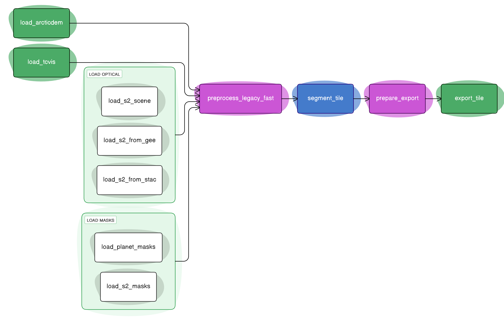

# Pipeline v2

The following document describes the pipeline which lead to the DARTS v1 dataset and will potentially lead to the DARTS v2 dataset.
The orginial v1 dataset was not created with this repository, however, a newer, faster version of this pipeline is implemented here, which still uses the exact same pipeline-steps.
Hence, it should be possible to re-create the DARTS v1 dataset with this repository.
The implemented pipeline in this repository could potentially be used for future iterations and releases of the DARTS dataset.

In addition to the PLANET version of the DARTS dataset, the pipeline also supports Sentinel 2 imagery as optical input, resulting in a lower spatial resolution (10m instead of 3m).

!!! note

    The v1 / v2 pipeline is also aliased by `legacy` pipeline somewhere deep in the code.

As of right now, four basic realizations of the v2 pipeline are implemented:

- `darts inference sentinel2-sequential`
- `darts inference planet-sequential`
- `darts inference sentinel2-ray`
- `darts inference planet-ray`

The `sequential` variants run without any parallelization framework, while the `ray` variants use Ray for distributed computing.

The pipeline currently consists of the following steps:

1. Load the optical and auxiliary data
    This step depends on the realization of the pipeline.
    Either [darts_acquisition.load_planet_scene][], [darts_acquisition.load_gee_s2_sr_scene][] or [darts_acquisition.load_cdse_s2_sr_scene][].
    Also loads the masks if not loaded from GEE or CDSE: [darts_acquisition.load_planet_masks][], for the GEE and CDSE versions the masks are already included.
    For the auxiliary data: [darts_acquisition.load_arcticdem][] and [darts_acquisition.load_tcvis][]
2. Preprocess the optical data: [darts_preprocessing.preprocess_v2][].
3. Segment the optical data: [darts_ensemble.EnsembleV1.segment_tile][].
4. Postprocess the segmentation and make it ready for export: [darts_postprocessing.prepare_export][].
5. Export the data: [darts_export.export_tile][].

{ loading=lazy }

A very simplified version of this implementation looks like this:

```python
from darts_acquisition import load_arcticdem, load_tcvis
from darts_acquisition.s2 import load_gee_s2_sr_scene
from darts_ensemble import EnsembleV1
from darts_export import export_tile
from darts_postprocessing import prepare_export
from darts_preprocessing import preprocess_v2

s2id = "20230701T194909_20230701T195350_T11XNA"
arcticdem_dir = "/path/to/arcticdem"
tcvis_dir = "/path/to/tcvis"
model_files = {
    "model1": "/path/to/model1.pt",
    "model2": "/path/to/model2.pt",
}
outpath = "/path/to/output"

ensemble = EnsembleV1(model_files)

tile = load_gee_s2_sr_scene(s2id)

arcticdem = load_arcticdem(
    tile.odc.geobox,
    arcticdem_dir,
    resolution=10,
    buffer=ceil(100 / 10 * sqrt(2)),
)

tcvis = load_tcvis(tile.odc.geobox, tcvis_dir)

tile = preprocess_v2(tile, arcticdem, tcvis, tpi_outer_radius=100, tpi_inner_radius=0)

tile = ensemble.segment_tile(tile, patch_size=1024, overlap=256, batch_size=8)

tile = prepare_export(tile, bin_threshold=0.5, mask_erosion_size=10, min_object_size=32)

export_tile(tile, outpath)
```

!!! abstract "Further reading"

    To learn more about how the pipeline and their components steps work, please refer to the following materials:

    - The Paper about the DARTS Dataset (No link yet)
    - The [Components Guide](components.md)
    - The [API Reference](../reference/darts/index.md)

There are further features implemented, which do not come from the components:

- Time tracking of processing steps (using `stopuhr` and `Chronometer`)
- Skipping of already processed tiles (via `missing_outputs` check)
- Environment debugging info (CUDA device selection and information)
- Result tracking (outputs saved to parquet files with status and errors)
- Ensemble support (using multiple models for improved predictions)
- Offline mode (for processing without internet connection)
- Configurable export bands (probabilities, binarized, polygonized, extent, thumbnail, optical, dem, tcvis, metadata)

## Minimal configuration example

For Sentinel-2 processing:

```toml
[darts]
ee-project = "ee-tobias-hoelzer"
model-files = ["./models/s2-tcvis-final-large_2025-02-12.ckpt"]
aoi-file = "./data/myaoi.gpkg"
start-date = "2024-07-01"
end-date = "2024-09-30"
```

Or using scene IDs directly:

```toml
[darts.inference.sentinel2-sequential]
model-files = ["./models/model1.pt", "./models/model2.pt"]
scene-ids = ["20230701T194909_20230701T195350_T11XNA", "20230704T195909_20230704T200350_T11XNA"]
output-data-dir = "./output"
```

## Full configuration explanation

The pipeline can be configured via command-line arguments or a TOML configuration file. All parameters from the CLI help output are available as configuration options.

### Core Parameters

- **model-files**: List of model file paths for ensemble segmentation. If a single model is provided, ensemble features are disabled.
- **output-data-dir**: Directory where processed outputs will be saved.
- **arcticdem-dir**: Directory containing ArcticDEM datacube (auto-downloaded if missing).
- **tcvis-dir**: Directory containing TCVis data.
- **device**: Computing device (`"cuda"`, `"cpu"`, `"auto"`, or specific GPU index).

### Scene Selection (Sentinel-2)

Four mutually exclusive methods:

1. **scene-ids**: Direct list of Sentinel-2 scene IDs
2. **scene-id-file**: Path to file containing scene IDs (one per line)
3. **tile-ids**: List of Sentinel-2 tile IDs + filtering parameters
4. **aoi-file**: Shapefile with area of interest + filtering parameters

### Filtering Parameters

- **start-date** / **end-date**: Date range in YYYY-MM-DD format
- **max-cloud-cover**: Maximum cloud cover percentage (default: 10)
- **max-snow-cover**: Maximum snow cover percentage (default: 10)
- **months**: List of months (1-12) for filtering
- **years**: List of years for filtering

### Processing Parameters

- **tpi-outer-radius**: Outer radius for TPI calculation in meters (default: 100)
- **tpi-inner-radius**: Inner radius for TPI calculation in meters (default: 0)
- **patch-size**: Tile size for inference (default: 1024)
- **overlap**: Overlap between patches (default: 256)
- **batch-size**: Batch size for inference (default: 8)
- **reflection**: Reflection padding for inference (default: 0)

### Postprocessing Parameters

- **binarization-threshold**: Threshold for converting probabilities to binary (default: 0.5)
- **mask-erosion-size**: Size of disk for mask erosion (default: 10)
- **edge-erosion-size**: Size for edge cropping, defaults to mask-erosion-size
- **min-object-size**: Minimum object size in pixels (default: 32)
- **quality-level**: Quality mask level: `"high_quality"`, `"low_quality"`, `"none"`, or int 0-2 (default: 1)

### Export Parameters

- **export-bands**: List of bands to export (default: `["probabilities", "binarized", "polygonized", "extent", "thumbnail"]`)
  - Available: `"probabilities"`, `"binarized"`, `"polygonized"`, `"extent"`, `"thumbnail"`, `"optical"`, `"dem"`, `"tcvis"`, `"metadata"`, or specific band names
- **write-model-outputs**: Save individual model outputs in addition to ensemble (default: False)

### Data Source Parameters (Sentinel-2)

- **raw-data-source**: Source for S2 data: `"cdse"` or `"gee"` (default: `"cdse"`)
- **raw-data-store**: Directory for storing raw S2 data locally
- **no-raw-data-store**: Disable local storage of raw data (default: False)
- **ee-project**: Earth Engine project ID (required for GEE source)
- **ee-use-highvolume**: Use EE high-volume server (default: True)

### Operational Flags

- **overwrite**: Overwrite existing outputs (default: False)
- **offline**: Run without downloading data (default: False)
- **debug-data**: Write intermediate debug data (default: False)

## Usage Examples

### Command Line

```bash
# Using an AOI file with date filtering
darts inference sentinel2-sequential \
    --aoi-file ./data/myaoi.gpkg \
    --start-date 2024-07-01 \
    --end-date 2024-09-30 \
    --model-files ./models/model1.pt ./models/model2.pt \
    --output-data-dir ./output

# Using specific scene IDs
darts inference sentinel2-sequential \
    --scene-ids 20230701T194909_20230701T195350_T11XNA \
    --model-files ./models/model.pt

# Planet pipeline
darts inference planet-sequential \
    --orthotiles-dir ./data/planet/orthotiles \
    --scenes-dir ./data/planet/scenes \
    --model-files ./models/planet_model.pt
```

### Configuration File

Create a `config.toml`:

```toml
[darts.inference.sentinel2-sequential]
aoi-file = "./data/myaoi.gpkg"
start-date = "2024-07-01"
end-date = "2024-09-30"
max-cloud-cover = 15
max-snow-cover = 5
model-files = ["./models/model1.pt", "./models/model2.pt"]
output-data-dir = "./output"
patch-size = 1024
overlap = 256
batch-size = 8
export-bands = ["probabilities", "binarized", "polygonized", "thumbnail"]
overwrite = false
```

Run with:

```bash
darts --config-file config.toml inference sentinel2-sequential
```

### Offline Processing

First, prepare data:

```bash
darts inference prep-data sentinel2 \
    --aoi-file ./data/myaoi.gpkg \
    --start-date 2024-07-01 \
    --end-date 2024-09-30 \
    --raw-data-store ./raw_data \
    --sentinel2-grid-dir ./aux_data/s2_grid
```

Then run offline:

```bash
darts inference sentinel2-sequential \
    --offline \
    --raw-data-store ./raw_data \
    --prep-data-scene-id-file ./raw_data/scene_ids.txt \
    --model-files ./models/model.pt
```
