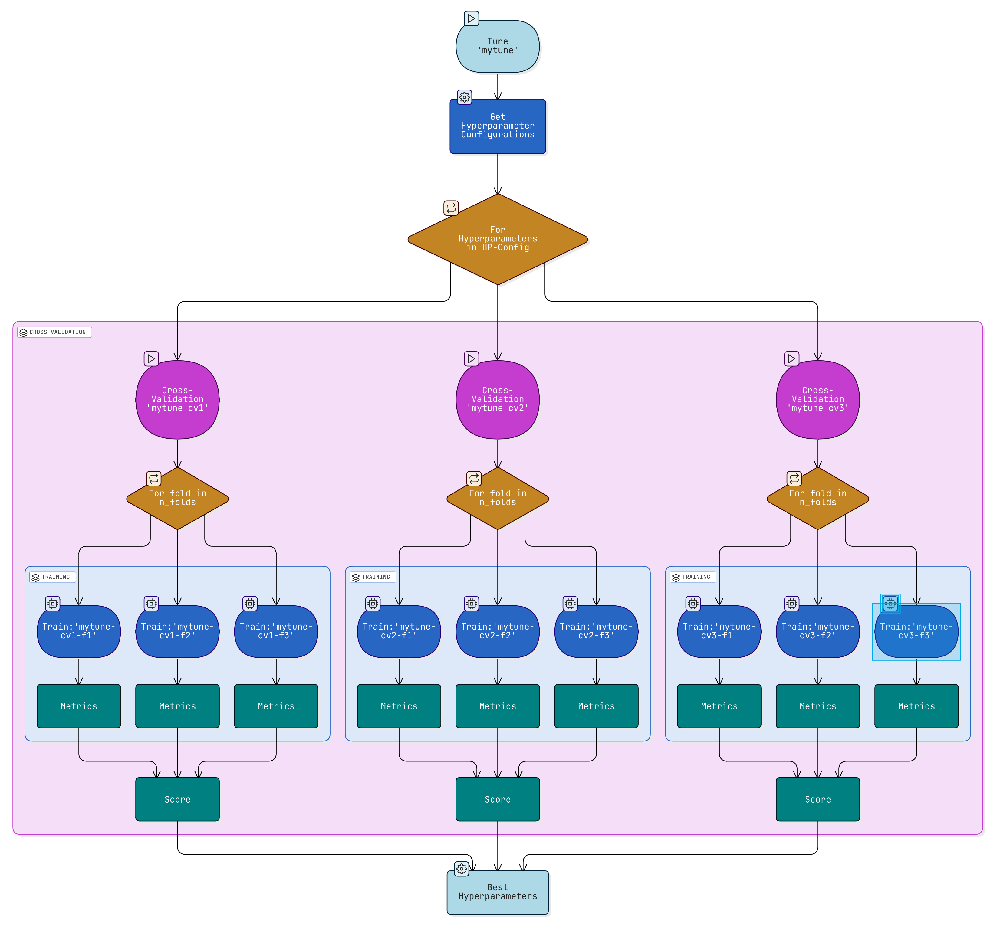
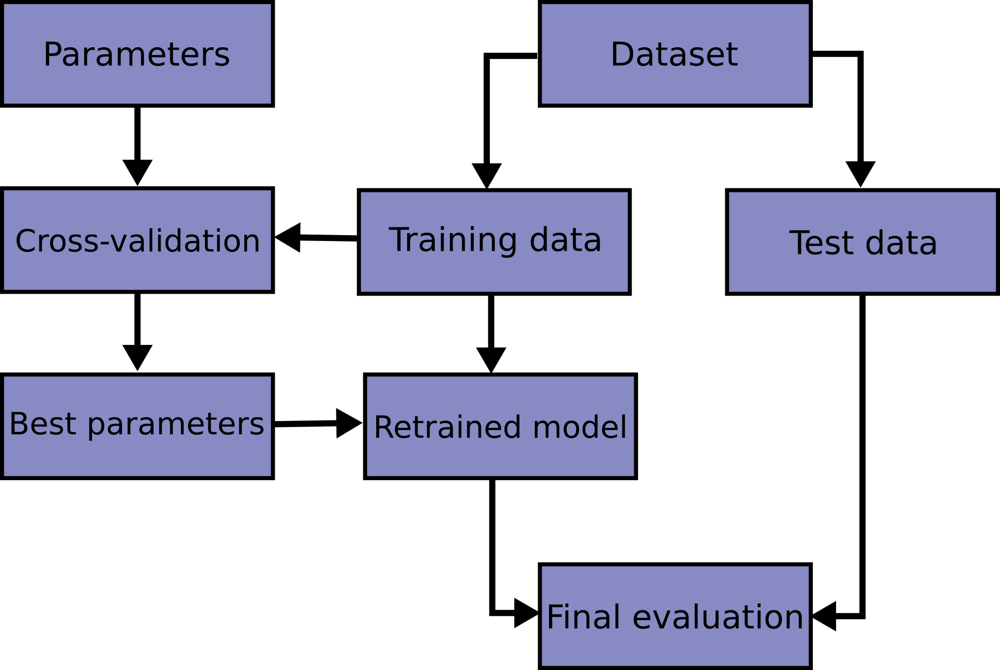
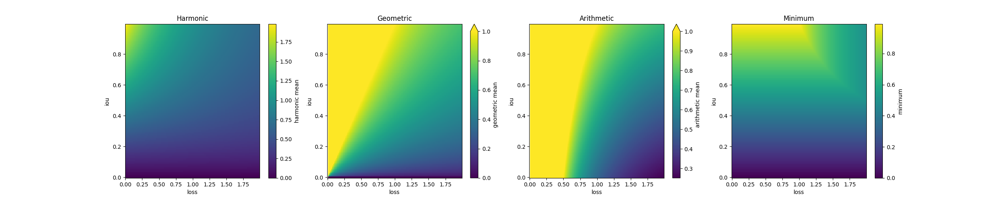
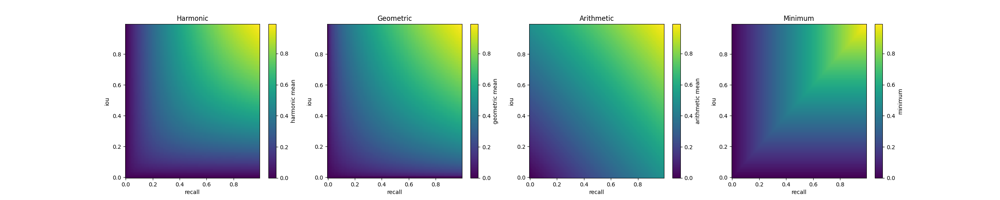

# Training (Binary Segmentation)

The "model creation process" (training) is implemented as a three-level hierarchy, meaning the upper level does several calls to the level below it:

1. Tuning (Hyperparameter-Sweeps)
2. Cross-Validation
3. (Training-) Run



[TOC]

## Preprocessing the data

???+ note "Preprocessed data"
All training scripts expect data to be present in preprocessed form.
This means that the `train_data_dir` must look like this:

    ```sh
    train_data_dir/
    ├── config.toml
    ├── data.zarr/
    ├── metadata.parquet
    └── labels.geojson
    ```

    The `data.zarr` is expected to be a zarr group containing a `x` and a `y` zarr array.
    This data contains the training data, hence images and labels - the shape of the `x` array must be `[n, c, h, w]` and of `y` `[n, h, w]` with `n` beeing the total number of samples, `c` the number of channels, `h` the height and `w` the width.
    The data must be complete, since splits and cross-validation folds are created on-the-fly by the training scripts.

    `metadata.parquet` must contain at least the following columns:
    - "sample_id": The id of the sample
    - "region": The region the sample belongs to
    - "empty": Whether the image has positive pixels
    The index must refer to the index of the sample in the zarr data.

    `config.toml` must contain all configuration parameters necessary to preprocess the data from scratch.
    Further, it must contain information about the bands (channels) used, which will be used to setup the model.
    The configuration should lay under the `darts` key of the file.

    `labels.geojson` should contain all labels used to create the binary segmentation masks.
    This file is purely for having reproducible results.

    Ideally, use the preprocessing functions explained below to create this structure.

To preprocess sentinel 2 data into the necessary structure, you can use the following command:

```sh
[uv run] darts preprocess-s2-train-data --your-args-here ...
```

!!! info "PLANET data"

    If you are using PLANET data, you can use the following command instead:

    ```sh
    [uv run] darts preprocess-planet-train-data --your-args-here ...
    ```

This will run the v2 preprocessing used by the v2 segmentation pipeline, but instead of passing the preprocessed data it creates patches of a fixed size and stores them into the `data.zarr` array.
Further, it will also create the necessary metadata, config and labels files.

The final train data is saved to disk in form of zarr arrays with dimensions `[n, c, h, w]` and `[n, h, w]` for the labels respectivly, with chunksizes of `n=1`.
Hence, every sample is saved in a separate chunk and therefore in a seperate file on disk, but all managed by zarr.

The preprocessing is done with the same components used in the v2 segmentation pipeline.
Hence, the same configuration options are available.

??? tip "You can also use the underlying functions directly:"

    ::: darts.training.preprocess_s2_train_data
        options:
            heading_level: 3

    ::: darts.training.preprocess_planet_train_data
        options:
            heading_level: 3

## Simple SMP train and test

To train a simple SMP (Segmentation Model Pytorch) model you can use the command:

```sh
[uv run] darts train-smp --your-args-here ...
```

Configurations for the architecture and encoder can be found in the [SMP documentation](https://smp.readthedocs.io/en/latest/index.html) for model configurations.

!!! warning "Change defaults"
Even though the defaults from the CLI are somewhat useful, it is recommended to create a config file and change the behavior of the training there.

This will train a model with the `cross-val` data and save the model to disk.
You don't need to specify the concrete path to the `cross-val` split, the training script expects that the `--train-data-dir` points to the root directory of the splits, hence, the same path used in the preprocessing should be specified.
The training relies on PyTorch Lightning, which is a high-level interface for PyTorch.
It is recommended to use Weights and Biases (wandb) for the logging, because the training script is heavily influenced by how the organization of wandb works.

Each training run is assigned a unique name and id pair and optionally a trial name.
The name, which the user _can_ provide, should be used as a grouping mechanism of equal hyperparameter and code.
Hence, different versions of the same name should only differ by random state or run settings parameter, like logs.
Each version is assigned a unique id.
Artifacts (metrics & checkpoints) are then stored under `{artifact_dir}/{run_name}/{run_id}` in no-crossval runs.
If `trial_name` is specified, the artifacts are stored under `{artifact_dir}/{trial_name}/{run_name}-{run_id}`.
Wandb logs are always stored under `{wandb_entity}/{wandb_project}/{run_name}`, regardless of `trial_name`.
However, they are further grouped by the `trial_name` (via job_type), if specified.
Both `run_name` and `run_id` are also stored in the hparams of each checkpoint.

You can now test the model on the other two splits (`val-test` and `test`) with the following command:

```sh
[uv run] darts test-smp --your-args-here ...
```

The checkpoint stored is not usable for the pipeline yet, since it is stored in a different format.
To convert the model to a format, you need to convert is first:

```sh
[uv run] darts convert-lightning-checkpoint --your-args-here ...
```

??? tip "You can also use the underlying functions directly:"

    ::: darts_segmentation.training.train_smp
        options:
            heading_level: 3

    ::: darts_segmentation.training.test_smp
        options:
            heading_level: 3

    ::: darts_segmentation.training.convert_lightning_checkpoint
        options:
            heading_level: 3

## Run a cross-validation hyperparameter sweep

!!! tip "Terminal Multiplexers"

    It is recommended to use a terminal multiplexer like `tmux`, `screen` or `zellij` to run multiple training runs in parallel.
    This way there is no need to have multiple terminal open over the span of multiple days.

To sweep over a certrain set of hyperparameters, some preparations are necessary:

1. Create a sweep configuration file in YAML format. This file should contain the hyperparameters to sweep over and the search space for each hyperparameter.
2. Setup a PostgreSQL database to store the results of the sweep, so we can run multiple runs in parallel with Optuna.

The sweep configuration file should look like a [wandb sweep configuration](https://docs.wandb.ai/guides/sweeps/sweep-config-keys/).
All values will be parsed and transformed to fit to an optuna sweep.

To setup the PostgreSQL database, search for an appropriate guide on how to setup a PostgreSQL database.
There are many ways to do this, depending on your environment.
The only important thing is that the database is reachable from the machine you are running the sweep on.

Now you can setup the sweep with the following command:

```sh
uv run darts optuna-sweep-smp --your-args-here ... --device 0
```

This will output some information about the sweep, especially the sweep id.
In addition, it will start running trials on the CUDA:0 device.

!!! note "Starting and continuing sweeps"

    Starting and continuing sweeps is done via the same `optuna-sweep-smp` command.
    Depending on the two arguments `-sweep-id` and `device`, the command will decide what to do.
    If the `sweep-id` is not specified, a new sweep will be started.
    If the `sweep-id` is specified, the sweep will continue from the last run.
    If the `device` is specified, `n-trials` will be started on the specified device (sequentially).
    If the `device` is not specified, but `sweep-id` is, then an error will be raised.
    If neither `device` nor `sweep-id` is specified, then a new sweep will be created without starting trials.

To start a second runner, you must open a new terminal (or panel/window in a terminal multiplexer) and run the following command:

```sh
uv run darts optuna-sweep-smp --your-args-here ... --device 1 --sweep-id <sweep-id>
```

!!! info "Multiple runners"

    You can run as many runners as you have devices available.
    Each runner will start n trials sequentially, specified by `n-trials`, which each request a new hyperparameter-combination from optuna.
    Each trial further creates multiple runs, depending on the `n_folds` and `n_randoms` parameters.
    This is the cross-validation part: Each trial, hence same hyperparameter-combination, is run `n_folds` times with `n_randoms` different random seeds.
    Therefore, the total number of runs done by a runner is `n-trials * n_folds * n_randoms`.
    This should ensure that a single random good (or bad) run does not influence the overall result of a hyperparameter-combination.

## Hyperparameter Tuning

With the tuning script hyperparameters can be tuned by running a sweep.
The sweep uses cross-validation to evaluate the performance of a single hyperparameter configuration.

How the hyperparameters should be sweeped can be configured in a YAML or Toml file, specified by the `hpconfig` parameter.
This file must contain a key called `"hyperparameters"` containing a list of hyperparameters distributions.
These distributions can either be explicit defined by another dictionary containing a `"distribution"` key,
or they can be implicit defined by a single value, a list or a dictionary containing a `"low"` and `"high"` key.

The following distributions are supported:

- `"uniform"`: Uniform distribution - must have a `"low"` and `"high"` value
- `"loguniform"`: Log-uniform distribution - must have a `"low"` and `"high"` value
- `"intuniform"`: Integer uniform distribution - must have a `"low"` and `"high"` value (both are inclusive)
- `"choice"`: Choice distribution - must have a list of `"choices"` for explicit case, else just pass a list
- `"value"`: Fixed value distribution - must have a `"value"` key for explicit case, else just pass a value

And the following hyperparameters can be configured:

| Hyperparameter        | Type          | Default  |
| --------------------- | ------------- | -------- |
| model_arch            | str           | "Unet"   |
| model_encoder         | str           | "dpn107" |
| model_encoder_weights | str or None   | None     |
| augment               | bool          | True     |
| learning_rate         | float         | 1e-3     |
| gamma                 | float         | 0.9      |
| focal_loss_alpha      | float or None | None     |
| focal_loss_gamma      | float         | 2.0      |
| batch_size            | int           | 8        |

Because the configuration file doesn't use the `darts` key, it can also be merged into the normal configuration file and specified by the `hpconfig` parameter to also use that file.

??? question "Why using a separate configuration file?"

    - It makes creating different sweeps easier
    - It separates the sweep configuration from the normal configuration
    - It allows for using dicts in the config - this is not possible right now due to the way we handle the main configuration file.

Per default, a random search is performed, where the number of samples can be specified by `n_trials`.
If `n_trials` is set to "grid", a grid search is performed instead.
However, this expects to be every hyperparameter to be configured as either constant value or a choice / list.

Optionally it is possible to retrain and test with the best hyperparameter configuration by setting `retrain_and_test` to `True`.
This will retrain the model on the complete train split without folding and test the data on the test split.

## Understanding internal workings

### Artifacts and Naming

Training artefacts are stored in an organized way so that one does not get lost in 1000s of different directories.
Especially when tuning hyperparameters, a lot of different runs are created, which can be difficult to track.

For organisation, each tune, cv and training run has it's own name, which _can_ be provided manually, but is usually generated automatically.
The name can only be provided manually for the call-level - hence when tuning one can only provide the name for the tune, respective cross-validations and training runs are named automatically based on the provided name.
If no name is provided, a random, but human-readable name is generated.
Further, a random 8-character id is also generated for each run, primarily for tracking purposes with Weights & Biases.

The naming scheme is as follows:

- `tune_name`: automatically generated or provided
- `cv_name`: `{tune_name}-cv{hp_index}` if called by tune, else automatically generated or provided
- `run_name`: `{cv_name}-run-f{fold_index}s{seed}` if called by cross-validation (or indirect tune), else automatically generated or provided
- `run_id`: 8-character id

Artifacts are stored in the following hierarchy:

- Created by runs of tunes: `{artifact_dir}/{tune_name}/{cv_name}/{run_name}-{run_id}`
- Created by runs of cross-validations: `{artifact_dir}/_cross_validations/{cv_name}/{run_name}-{run_id}`
- Created by single runs: `{artifact_dir}/_runs/{run_name}-{run_id}`

This way, the top-level `artifact_dir` is kept clean and organized,

The cross-validation will not only contain the artifacts from the training runs but also a `run_infos.parquet` file with information about each run / experiment.
This dataframe contains a `fold`, `seed`, `duration`, `checkpoint`, `is_unstable`, `is_unstable` and metrics columns, where the metrics are taken from the `trainer.callback_metrics`.
The `is_unstable` column indicates whether the score-metrics of the run were unstable (not finite or zero).
Further, it also contains a `score` and a `score_is_unstable` column, which contains the score and a boolean indicating whether any run of the cross-validation was unstable.
These columns contain the same value for every row (run), since they are valid for the complete cross-validation.

Weights & Biases is optionally used for further tracking and logging.
`wandb_project` and `wandb_entity` can be used to specify the project and entity for logging.
Wandb will create a run `run_id` named `{run_name}`, meaning the id can be used to directly access the run via link and the name can be used for searching a run.
For cross-validation and tuning `cv_name` and `tune_name` are set as `job_type` and `group` to emulate sweeps.
This is a workaround and could potentially fixed if wandb will update their client library to allow the manual creation of sweeps.

### About random-state

All random state of the tuning and the cross-validation is seeded to 42.
Random state of the training can be specified through a parameter.
The cross-validation will not only cross-validates along different folds but also over different random seeds.
Thus, for a single cross-validation with 5 folds and 3 seeds, 15 runs will be executed.

### About data splits cross-validation

The general idea behind the process of a tune or a cross-validation follows the [`scikit-learn` cross-validation process](https://scikit-learn.org/stable/modules/cross_validation.html).
{ loading=lazy }

The initial training/test data split is performed by using the `data_split_method` and `data_split_by` parameters.
`data_split_method` can be one of the following:

- `"random"` will split the data randomly, the seed is always 42 and the size of the test set can be specified by providing a float between 0 and 1 to `data_split_by`.
- `"region"` will split the data by one or multiple regions, which can be specified by providing a str or list of str to `data_split_by`.
- `"sample"` will split the data by sample ids, which can be specified similar to `"region"`.
- `None`, no split is done and the complete dataset is used for both training and testing.

While cross-validating, the data can further be split into a training and validation set.
One can specify the fraction of the validation set by providing an integer to `total_folds`.
Higher values will result in smaller, validation sets and therefore more fold-combinations.
To reduce the number of folds actually run, one can provide the `n_folds` parameter to limit the number of folds actually run.
Thus, some folds will be skipped.
The "folding" is based on `scikit-learn` and currently supports the following folding methods, which can be specified by the `fold_method` parameter:

- `"kfold"`: Split the data into `total_folds` folds, where each fold can be used as a validation set. Uses [sklearn.model_selection.KFold][].
- `"stratified"`: Will use the `"empty"` column of the metadata to create `total_folds` shuffled folds where each fold contains the same amount of empty and non-empty samples. Uses [sklearn.model_selection.StratifiedKFold][].
- `"shuffle"`: Similar to `"stratified"`, but the order of the data is shuffled before splitting. Uses [sklearn.model_selection.StratifiedShuffleSplit][].
- `"region"`: Will use the `"region"` column of the metadata to create `total_folds` folds where each fold splits the data by one or multiple regions. Uses [sklearn.model_selection.GroupShuffleSplit][].
- `"region-stratified"`: Merge of the `"region"` and `"stratified"` methods. Uses [sklearn.model_selection.StratifiedGroupKFold][].

Even in normal training a single KFold split is used to split between training and validation.
This can be disabled by setting `fold_method` to `None`.
In such cases, the validation set becomes equal to the training set, meaning longer validation time and the metrics are always calculated on seen data.
This is useful for e.g. the final training of a model before deployment.

??? tip "Using DartsDataModule"

    The data splitting is implemented by the [darts_segmentation.training.data.DartsDataModule][] and can therefore be used in other settings as well.

    ::: darts_segmentation.training.data.DartsDataModule
        options:
            heading_level: 3
            members: false

### Scoring strategies of cross-validation

To turn the information (metrics) gathered of a single cross-validation into a useful score, we need to somehow aggregate the metrics.
In cases we are only interested in a single metric, this is easy: we can easily compute the mean.
This metric can be specified by the `scoring_metric` parameter of the cross validation.
It is also possible to use multiple metrics by specifying a list of metrics in the `scoring_metric` parameter.
This, however, makes it a little more complicated.

Multi-metric scoring is implemented as combine-then-reduce, meaning that first for each fold the metrics are combined using the specified strategy, and then the results are reduced via mean.
The combining strategy can be specified by the `multi_score_strategy` parameter.
As of now, there are four strategies implemented: `"arithmetic"`, `"geometric"`, `"harmonic"` and `"min"`.

The following visualization should help visualize how the different strategies work.
Note that the loss is interpreted as "lower is better" and has also a broader range of possible values, exceeding 1.
For the multi-metric scoring with IoU and Loss the arithmetic and geometric strategies are very instable.
The scores for very low loss values where so high that the scores needed to be clipped to the range [0, 1] for the visualization to be able to show the behaviour of these strategies.
However, especially the geometric mean shows a smoother curve than the harmonic mean for the multi-metric scoring with IoU and Recall.
This should show that the strategy should be chosen carefully and in respect to the metrics used.

|              |                                                                                                              |
| -----------: | ------------------------------------------------------------------------------------------------------------ |
|   IoU & Loss | { loading=lazy }     |
| IoU & Recall | { loading=lazy } |

??? tip "Code to reproduce the visualization"

    If you are unsure which strategy to use, you can use this code snippet to make a visualization based on your metrics:

    ```py
    import numpy as np
    import xarray as xr

    a = np.arange(0, 1, 0.01)
    a = xr.DataArray(a, dims=["a"], coords={"a": a})
    # 1 / ... indicates "lower is better" - replace it if needed
    b = np.arange(0, 2, 0.01)
    b = 1 / xr.DataArray(b, dims=["b"], coords={"b": b})

    def viz_strategies(a, b):
        harmonic = 2 / (1 / a + 1 / b)
        geometric = np.sqrt(a * b)
        arithmetic = (a + b) / 2
        minimum = np.minimum(a, b)

        harmonic = harmonic.rename("harmonic mean")
        geometric = geometric.rename("geometric mean")
        arithmetic = arithmetic.rename("arithmetic mean")
        minimum = minimum.rename("minimum")

        fig, axs = plt.subplots(1, 4, figsize=(25, 5))
        axs = axs.flatten()
        harmonic.plot(ax=axs[0])
        axs[0].set_title("Harmonic")
        geometric.plot(ax=axs[1], vmax=min(geometric.max(), 1))
        axs[1].set_title("Geometric")
        arithmetic.plot(ax=axs[2], vmax=min(arithmetic.max(), 1))
        axs[2].set_title("Arithmetic")
        minimum.plot(ax=axs[3])
        axs[3].set_title("Minimum")
        return fig

    viz_strategies(a, b).show()
    ```

Each score can be provided by either ":higher" or ":lower" to indicate the direction of the metrics.
This allows to correctly combine multiple metrics by doing 1/metric before calculation if a metric is ":lower".
If no direction is provided, it is assumed to be ":higher".
Has no real effect on the single score calculation, since only the mean is calculated there.

!!! abstract "Available metrics" - `"val/JaccardIndex"` - `"val/Recall"`
TODO add more from trainer class
TODO: Implement https://lightning.ai/docs/pytorch/stable/api/lightning.pytorch.callbacks.ThroughputMonitor.html

## Recommendations & best practices

TODO

- Best folding method: `"region-stratified"`
- Best multi-scoring strategy: `"geometric"` for combinations of recall, precision, f1 and jaccard index / iou, else `"harmonic"`
- Test split should be `"region"` to the hardest region.

## Example config and sweep-config files

For better readability, the example config file uses different sub-headings which are not necessary and could be named differently or even removed.
The only important heading is the `[darts]` heading, which is the root of the configuration file.
Every value which is not under a `darts` top-level heading is ignored, as descriped in the [Configuration Guide](config.md).

The following `config.toml` expects that the labels are cloned from the [ML_training_labels repository](https://github.com/initze/ML_training_labels) and that PLANET scenes and tiles are downloaded into the `/large-storage/planet_data` directory.
The resulting file structure would look like this:

```sh title="File structure under cd ."
./
├── ../ML_training_labels/retrogressive_thaw_slumps/
├── darts/
├── logs/
└── configs/
    ├── planet-sweep-config.toml
    └── planet-tcvis-sweep.yaml
```

```sh title="File structure under /large-storage/"
/large-storage/
├── planet_data/
└── darts-nextgen/
    ├── artifacts/
    └── data/
        ├── training/
        │   └── planet_native_tcvis_896_partial/
        ├── cache/
        ├── datacubes/
        │   ├── arcticdem/
        │   └── tcvis/
        └── aux/admin/
```

```sh title="File structure under /fast-storage/"
/fast-storage/
└── darts-nextgen/
    └── data/
        └── training/
            └── planet_native_tcvis_896_partial/
```

```toml title="configs/planet-sweep-config.toml"
[darts.wandb]
wandb-project = "darts"
wandb-entity = "your-wandb-username"

[darts.sweep]
n-trials = 100
sweep-db = "postgresql://pguser@localhost:5432/sweeps"
n_folds = 3
n_randoms = 3
sweep-id = "sweep-cv-large-planet"

[darts.training]
num-workers = 16
max-epochs = 60
log-every-n-steps = 100
check-val-every-n-epoch = 5
plot-every-n-val-epochs = 4 # == 20 epochs
early-stopping-patience = 0

# These are the default one, if not specified in the sweep-config
[darts.hyperparameters]
batch-size = 6
augment = true

[darts.training_preprocess]
ee-project = "your-ee-project"
tpi-outer-radius = 100
tpi-inner-radius = 0
bands = [
    'blue',
    'green',
    'red',
    'nir',
    'ndvi',
    'tc_brightness',
    'tc_greenness',
    'tc_wetness',
    'relative_elevation',
    'slope',
]
patch-size = 896
overlap = 0 # increase to 64 if exclude-nan = True
exclude-nopositive = false
exclude-nan = false
test-val-split = 0.05
test-regions = ['Taymyrsky Dolgano-Nenetsky District']

[darts.paths]
data-dir = "/large-storage/planet_data"
labels-dir = "../ML_training_labels/retrogressive_thaw_slumps" # (1)
arcticdem-dir = "/large-storage/darts-nextgen/data/datacubes/arcticdem"
tcvis-dir = "/large-storage/darts-nextgen/data/datacubes/tcvis"
admin-dir = "/large-storage/darts-nextgen/data/aux/admin"
train-data-dir = "/fast-storage/darts-nextgen/data/training/planet_native_tcvis_896_partial" # (2)
preprocess-cache = "/large-storage/darts-nextgen/data/cache"
sweep-config = "configs/planet-tcvis-sweep.yaml"
artifact-dir = "/large-storage/darts-nextgen/artifacts"
```

1. Clone [this repository](https://github.com/initze/ML_training_labels) to obtain the labels for the training data.
2. The `train-data-dir` should point to a fast read-access storage, like a local mounted SSD to speed up the training process.

```yaml title="configs/planet-tcvis-sweep.yaml"
name: planet-tcvis-large
method: random
metric:
  goal: maximize
  name: val0/JaccardIndex
parameters:
  learning_rate:
    max: !!float 1e-3
    min: !!float 1e-5
    distribution: log_uniform_values
  gamma: # How fast the learning rate will decrease
    value: 0.997
  focal_loss_alpha: # How much the positive class is weighted
    min: 0.8
    max: 0.99
  focal_loss_gamma: # How much focus should be given to "bad" predictions
    min: 0.0
    max: 2.0
  model_arch:
    values:
      - Unet
      - MAnet
      - UPerNet
      - Segformer
  model_encoder:
    values:
      - resnet50
      - resnext50_32x4d
      - mit_b2
      - tu-convnextv2_tiny
      - tu-maxvit_tiny_rw_224
```
