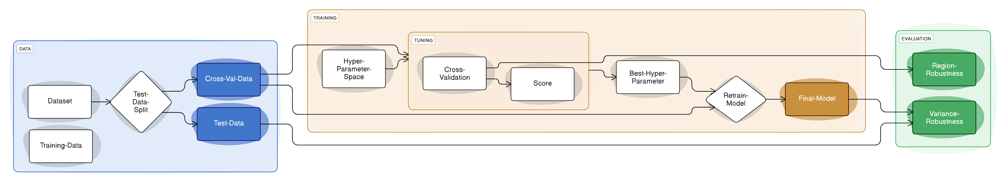

# Training

!!! danger "Old documentation"
    This page is still under construction.

!!! note "Preprocessed data"
    All training and sweeps expect data to be present in preprocessed form.

## Preprocess the data

The train, validation and test flow ist best descriped in the following image:
{ loading=lazy }

To split your sentinel 2 data into the three different datasets and preprocess it, you can use the following command:

```sh
[uv run] darts preprocess-s2-train-data --your-args-here ... 
```

!!! info "PLANET data"

    If you are using PLANET data, you can use the following command instead:

    ```sh
    [uv run] darts preprocess-planet-train-data --your-args-here ...
    ```

This will create three data splits:

- `cross-val`, used for train and validation
- `val-test` 5% random leave-out for testing the randomness distribution shift of the data
- `test` leave-out region for testing the spatial distribution shift of the data

The final train data is saved to disk in form of zarr arrays with dimensions `[n, c, h, w]` and `[n, h, w]` for the labels respectivly, with chunksizes of `n=1`.
Hence, every sample is saved in a separate chunk and therefore in a seperate file on disk, but all managed by zarr.

The preprocessing is done with the same components used in the segmentation pipeline.
Hence, the same configuration options are available.
In addition, this preprocessing splits larger images into smaller patches of a fixed size.
Size and overlap can be configured in the configuration file or via the arguments of the CLI.

??? tip "You can also use the underlying functions directly:"

    ::: darts.legacy_training.preprocess_s2_train_data
        options:
            heading_level: 3

    ::: darts.legacy_training.preprocess_planet_train_data
        options:
            heading_level: 3

## Simple SMP train and test

To train a simple SMP (Segmentation Model Pytorch) model you can use the command:

```sh
[uv run] darts train-smp --your-args-here ...
```

!!! warning "Change defaults"
    Even though the defaults from the CLI are somewhat useful, it is recommended to create a config file and change the behavior of the training there.

This will train a model with the `cross-val` data and save the model to disk.
You don't need to specify the concrete path to the `cross-val` split, the training script expects that the `--train-data-dir` points to the root directory of the splits, hence, the same path from the preprocessing should be specified.
The training relies on PyTorch Lightning, which is a high-level interface for PyTorch.
It is recommended to use Weights and Biases (wandb) for the logging, because the training script is heavily influenced by how the organization of wandb works.


You can now test the model on the other two splits (`val-test` and `test`) with the following command:

```sh
[uv run] darts test-smp --your-args-here ...
```

The checkpoint stored is not usable for the pipeline yet, since it is stored in a different format.
To convert the model to a format, you need to convert is first:

```sh
[uv run] darts convert-lightning-checkpoint --your-args-here ...
```


??? tip "You can also use the underlying functions directly:"

    ::: darts.legacy_training.train_smp
        options:
            heading_level: 3

    ::: darts.legacy_training.test_smp
        options:
            heading_level: 3

    ::: darts.legacy_training.convert_lightning_checkpoint
        options:
            heading_level: 3

## Run a hyperparameter sweep
