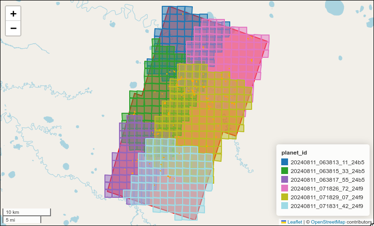
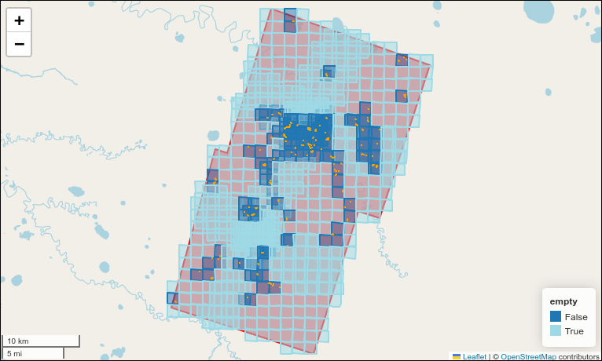

# Preprocessing

To preprocess planet data into the necessary structure, you can use the following command:

```sh
[uv run] darts training create-dataset planet --your-args-here ...
```

This will run the v2 preprocessing used by the v2 segmentation pipeline, but instead of passing the preprocessed data it creates patches of a fixed size and stores them into the `data.zarr` array.
Further, it will also create the necessary metadata, config and labels files.

The final train data is saved to disk in form of zarr arrays with dimensions `[n, c, h, w]` and `[n, h, w]` for the labels respectivly, with chunksizes of `n=1`.
Hence, every sample is saved in a separate chunk and therefore in a seperate file on disk, but all managed by zarr.

The preprocessing is done with the same components used in the v2 segmentation pipeline.
Hence, the same configuration options are available.

??? tip "You can also use the underlying function directly:"

    [darts.training.preprocess_planet_train_data][]


## Training data structure

The `train_data_dir` must look like this:

```sh
train_data_dir/
├── config.toml
├── data.zarr/
└── metadata.parquet
```

The `data.zarr` is expected to be a zarr group containing a `x` and a `y` zarr array.
This data contains the training data, hence images and labels - the shape of the `x` array must be `[n, c, h, w]` and of `y` `[n, h, w]` with `n` beeing the total number of samples, `c` the number of channels, `h` the height and `w` the width.
The data must be complete, since splits and cross-validation folds are created on-the-fly by the training scripts.

`metadata.parquet` must contain at least the following columns:

- "sample_id": The id of the sample
- "region": The region the sample belongs to
- "empty": Whether the image has positive pixels
The index must refer to the index of the sample in the zarr data.

`config.toml` must contain all configuration parameters necessary to preprocess the data from scratch.
Further, it must contain information about the bands (channels) used, which will be used to setup the model.
The configuration should lay under the `darts` key of the file.

Ideally, use the preprocessing functions explained above to create this structure.

### Own preprocessing

If you want to use your own preprocessing, you can do so by either creating the data yourself or by using the [darts_segmentation.training.prepare_training.TrainDatasetBuilder][] helper class.

The usage is quite simple:

```python
from darts_segmentation.training.prepare_training import TrainDatasetBuilder
    from darts_segmentation.utils import Bands

bands = Bands.from_dict(
    {
        # "name": (scale, offset)
        "red": (1 / 3000, 0.0),
        "green": (1 / 3000, 0.0),
        "blue": (1 / 3000, 0.0),
    }
)

builder = TrainDatasetBuilder(
    train_data_dir=train_data_dir,  # The directory where the data is stored
    patch_size=patch_size, # The size of the patches to create
    overlap=overlap, # The overlap of the patches
    bands=bands, # The bands to use, expects the Bands class
    exclude_nopositive=exclude_nopositive, # Whether to exclude samples without positive pixels
    exclude_nan=exclude_nan, # Whether to exclude samples with NaN values
    mask_erosion_size=mask_erosion_size, # How much the mask should be eroded (increase size of nan-holes)
    device=device, # The device to use for preprocessing should be a torch.device
)

for tile, labels, region in your_data:
    # tile (your sample) should be an xarray Dataset with at least the bands specified above as variables
    # labels should be an geopandas GeoDataFrame
    builder.add_tile(
        tile=tile,
        labels=labels,
        region=region, # Region should be a str describing the region of your sample, can be arbitrary
        sample_id=sample_id, # A unique id for the sample
        metadata={
            ... # Any metadata you want to store with the sample, not mandatory
        },
    )

builder.finalize(
    {
        ... # Any metadata you want to store with in the final config, not mandatory
    }
)

```

## About patching

The preprocessing will create patches of the images and labels to increase performance.
Read performance is actually pretty important for training smaller models, since the time it takes for an image to be read from disk is in relation to the training step of smaller models significant.
That is why we store the patches in a zarr array beforehand, so we gain maximum read performance.

The information about the patches, meaning region, id, geometry etc., are stored in the metadata file.

The following image shows an examples of how these patches look like when visualized.
The data of the example comes from a single year - hence all labels are applied to all images.
Of course one can write a pipeline matches labels to specific images, and in case the default pipeline works like this.
However, this is an easier example to visualize the patches.
Further, this example only covers a single region.
Of course this can also be done for multiple regions and extents.
Both examples show the extent in red in the background together with the labels in orange and the colored patches.
The first example shows which patch comes from which image.
The second example shows which patch is empty, meaning it has no positive pixels in the labels.

{ loading=lazy }

{ loading=lazy }
